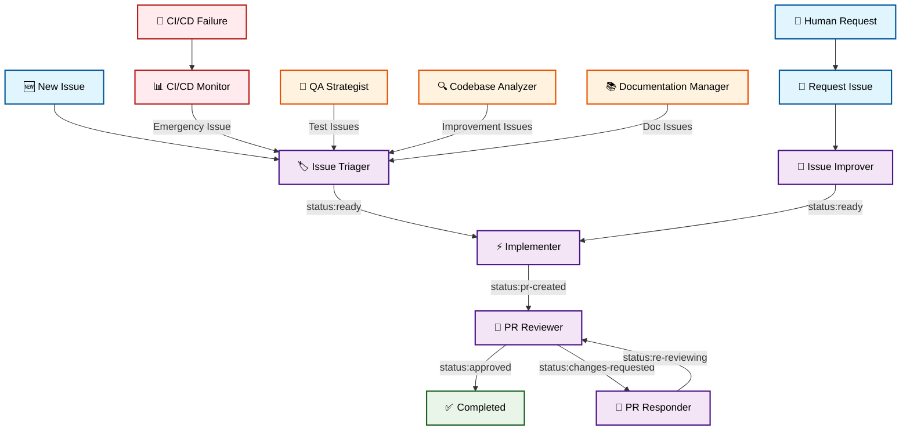
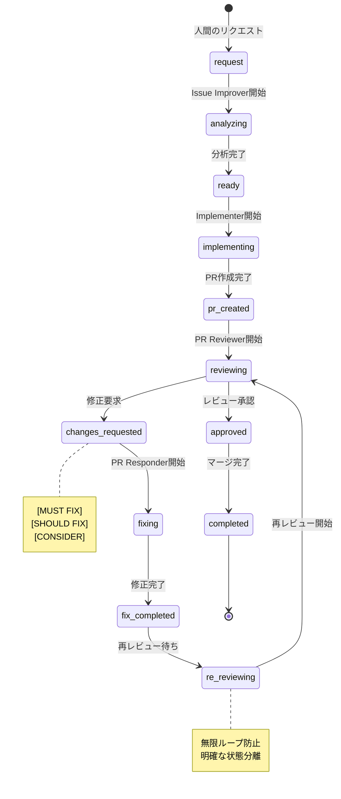
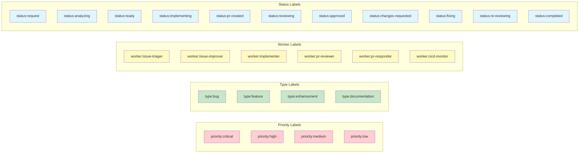

# Claude Developer 自動化ツール

プロンプトテンプレートを使って Claude Code を実行するシンプルなツールです。プロンプト内の変数を引数で縛れるため、様々な自動化タスクに活用できます。

## 概要

このツールは、テキストファイルに記述したプロンプトを Claude Code で実行します。プロンプト内の変数を引数で縛れるため、様々な自動化タスクに活用できます。

## セットアップ

```bash
chmod +x automation.sh
```

## 使い方

```bash
./automation.sh <プロンプトファイル> [引数1] [引数2] ...
```

### 例

```bash
# プロジェクト分析とISSUE作成
./automation.sh issue_creator

# カスタムプロンプトを実行
./automation.sh my_prompt.txt

# 複数の引数を渡す
./automation.sh custom.txt param1 param2
```

## プロンプトテンプレート

### デフォルトテンプレート

`prompts/` ディレクトリに以下のテンプレートが含まれています：

- `issue_creator.txt` - プロジェクト分析と ISSUE 作成
- `custom_example.txt` - カスタムプロンプトの例

### 変数の縛り方

プロンプト内で `{{ARG1}}`、`{{ARG2}}` などの変数を使用でき、実行時の引数で縛られます：

```bash
# pr_review.txt 内の {{ARG1}} が 123 に縛られる
./automation.sh pr_review 123
```

### カスタムプロンプトの作成

新しいプロンプトファイルを作成して、任意のタスクを自動化できます：

```bash
echo "プロジェクトのテストを実装してレポートを生成してください" > prompts/run_tests.txt
./automation.sh run_tests
```

## Cron での自動実行

```bash
# cron設定例を表示
./cron_examples.sh

# 例: 毎日朝9時にプロジェクト分析
0 9 * * * cd /path/to/project && ./automation.sh issue_creator >> ./claude_developer.log 2>&1

# 例: 毎時プロンプトを実行
0 * * * * cd /path/to/project && ./automation.sh my_hourly_task >> ./claude_developer.log 2>&1
```

## 環境変数設定

環境変数を使用してスクリプトの動作をカスタマイズできます。

### 設定方法

1. サンプルファイルをコピーして設定ファイルを作成：

```bash
cp .env.sample .env
```

2. `.env` ファイルを編集して値を設定

3. 環境変数を読み込んで実行：

```bash
# 環境変数を読み込んで実行
source .env && ./automation.sh issue_creator

# または一時的に設定して実行
LOG_DIR=/custom/log/path ./automation.sh issue_creator
```

### 利用可能な環境変数

- `PROJECT_PATH` - プロジェクトパス（デフォルト: カレントディレクトリ）
- `LOG_DIR` - ログ出力ディレクトリ（デフォルト: ./logs）
- `PROMPTS_DIR` - プロンプトディレクトリ（デフォルト: ./prompts）
- `ANTHROPIC_API_KEY` - Anthropic APIキー
- `ANTHROPIC_MODEL` - 使用するClaudeモデル

### ログファイル

実行ごとに以下のログファイルが生成されます：

- `{プロンプト名}_{タイムスタンプ}.log` - Claude Codeの実行ログ
- `system_{タイムスタンプ}.log` - システムメッセージログ

例：
```
logs/
├── issue_creator_20240531_143022.log
├── system_20240531_143020.log
└── system_20240531_143025.log
```

## 必要環境

- Claude Code CLI (`claude` コマンド)
- GitHub CLI (`gh` コマンド)
- jq
- git
- bash

## 📋 プロンプトワークフロー図

### 全体ワークフロー



### ステータス遷移図



### Worker排他制御とラベル管理



## 🔧 ワークフロー整合性改善

### プロンプトファイル詳細

| プロンプト | 役割 | 入力条件 | 出力ステータス |
|-----------|-----|----------|---------------|
| **Issue Triager** | 新規ISSUE分析・分類 | ラベル未設定ISSUE | `status:ready` |
| **Issue Improver** | リクエストの詳細化 | `status:request` | `status:ready` |
| **Implementer** | 実装とPR作成 | `status:ready` | `status:pr-created` |
| **PR Reviewer** | PRレビュー実行 | `status:pr-created`<br/>`status:re-reviewing` | `status:approved`<br/>`status:changes-requested` |
| **PR Responder** | レビュー修正対応 | `status:changes-requested` | `status:re-reviewing` |
| **CI/CD Monitor** | CI/CD失敗監視 | ワークフロー失敗検出 | 緊急ISSUE作成 |
| **QA Strategist** | テスト戦略分析 | 独立実行 | テスト改善ISSUE |
| **Codebase Analyzer** | コード品質分析 | 独立実行 | 改善ISSUE作成 |
| **Documentation Manager** | ドキュメント管理 | 独立実行 | ドキュメントISSUE |

### 主要改善点

#### 1. ステータス遷移の明確化
- **新ステータス追加**: `status:re-reviewing` を新設
- **無限ループ防止**: `fix-completed` → `re-reviewing` → `approved/changes-requested`
- **状態分離**: 初回レビューと修正後レビューの明確な区別

#### 2. Worker排他制御の強化
- **並行処理制御**: 同一Issue/PRでの複数Worker同時実行を防止
- **処理中表示**: `worker:*` ラベルによる実行状況の明示
- **適切な解放**: 処理完了時のworkerラベル自動除去

#### 3. CI/CD統合の改善
- **統合フロー**: CI/CD Monitor によるISSUE作成を既存ワークフローに統合
- **統一ラベル**: `priority:critical` + `worker:cicd-monitor` の組み合わせ
- **緊急度統一**: 全プロンプト間での緊急度判定基準統一

### エラーハンドリング強化
- **デッドロック防止**: 異常状態の自動検出と復旧
- **メトリクス収集**: 各ステータスでの滞留時間測定
- **品質保証**: Worker別処理時間とエラー率の監視

これらの改善により、より堅牢で信頼性の高い自動化システムが実現されました。