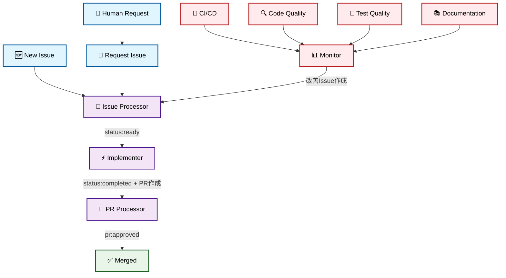
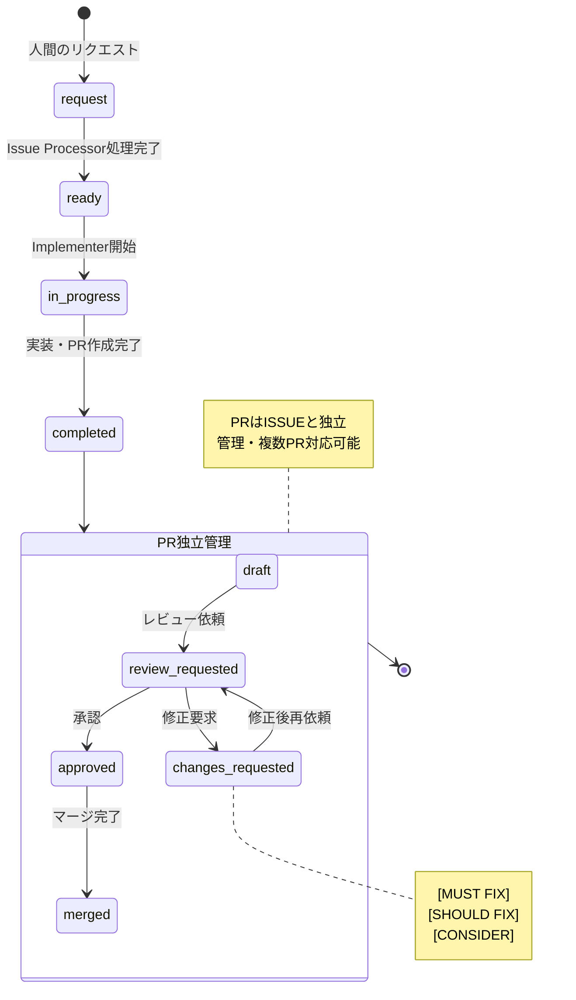
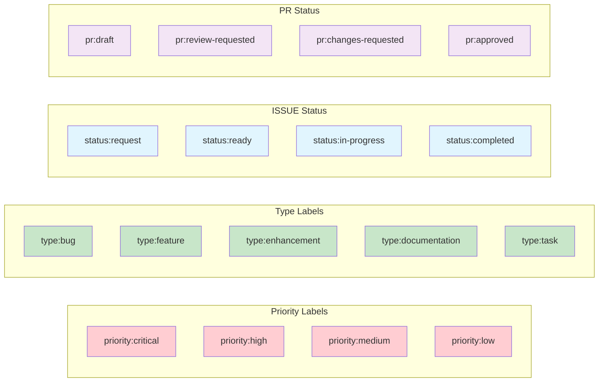

# Claude Developer 自動化ツール

プロンプトテンプレートを使って Claude Code を実行するシンプルなツールです。プロンプト内の変数を引数で縛れるため、様々な自動化タスクに活用できます。

## 概要

このツールは、テキストファイルに記述したプロンプトを Claude Code で実行します。プロンプト内の変数を引数で縛れるため、様々な自動化タスクに活用できます。

## セットアップ

```bash
chmod +x automation.sh
```

## 使い方

```bash
./automation.sh <プロンプトファイル> [引数1] [引数2] ...
```

### 例

```bash
# プロジェクト分析とISSUE作成
./automation.sh issue_creator

# カスタムプロンプトを実行
./automation.sh my_prompt.txt

# 複数の引数を渡す
./automation.sh custom.txt param1 param2
```

## プロンプトテンプレート

### デフォルトテンプレート

`prompts/` ディレクトリに以下のテンプレートが含まれています：

- `issue_processor.txt` - ISSUE分析・改善・準備（統合）
- `implementer.txt` - 実装・PR作成
- `pr_processor.txt` - PRレビュー・修正対応（統合）
- `monitor.txt` - CI/CD・コード品質・テスト・ドキュメント監視（統合）

### 変数の縛り方

プロンプト内で `{{ARG1}}`、`{{ARG2}}` などの変数を使用でき、実行時の引数で縛られます：

```bash
# pr_review.txt 内の {{ARG1}} が 123 に縛られる
./automation.sh pr_review 123
```

### カスタムプロンプトの作成

新しいプロンプトファイルを作成して、任意のタスクを自動化できます：

```bash
echo "プロジェクトのテストを実装してレポートを生成してください" > prompts/run_tests.txt
./automation.sh run_tests
```

## Cron での自動実行

```bash
# cron設定例を表示
./cron_examples.sh

# 例: 毎日朝9時にプロジェクト分析
0 9 * * * cd /path/to/project && ./automation.sh issue_creator >> ./claude_developer.log 2>&1

# 例: 毎時プロンプトを実行
0 * * * * cd /path/to/project && ./automation.sh my_hourly_task >> ./claude_developer.log 2>&1
```

## 環境変数設定

環境変数を使用してスクリプトの動作をカスタマイズできます。

### 設定方法

1. サンプルファイルをコピーして設定ファイルを作成：

```bash
cp .env.sample .env
```

2. `.env` ファイルを編集して値を設定

3. 環境変数を読み込んで実行：

```bash
# 環境変数を読み込んで実行
source .env && ./automation.sh issue_creator

# または一時的に設定して実行
LOG_DIR=/custom/log/path ./automation.sh issue_creator
```

### 利用可能な環境変数

- `PROJECT_PATH` - プロジェクトパス（デフォルト: カレントディレクトリ）
- `LOG_DIR` - ログ出力ディレクトリ（デフォルト: ./logs）
- `PROMPTS_DIR` - プロンプトディレクトリ（デフォルト: ./prompts）
- `ANTHROPIC_API_KEY` - Anthropic APIキー
- `ANTHROPIC_MODEL` - 使用するClaudeモデル

### ログファイル

実行ごとに以下のログファイルが生成されます：

- `{プロンプト名}_{タイムスタンプ}.log` - Claude Codeの実行ログ
- `system_{タイムスタンプ}.log` - システムメッセージログ

例：
```
logs/
├── issue_creator_20240531_143022.log
├── system_20240531_143020.log
└── system_20240531_143025.log
```

## 必要環境

- Claude Code CLI (`claude` コマンド)
- GitHub CLI (`gh` コマンド)
- jq
- git
- bash

## 📋 プロンプトワークフロー図

### 全体ワークフロー（簡略化版）



### ステータス遷移図（簡略化版）



### ラベル管理（簡略化版）



## 🔧 ワークフロー整合性改善

### プロンプトファイル詳細（簡略化版）

| プロンプト | 役割 | 入力条件 | 出力ステータス |
|-----------|-----|----------|---------------|
| **Issue Processor** | ISSUE分析・改善・準備（統合） | `status:request` または未ラベルISSUE | `status:ready` |
| **Implementer** | 実装とPR作成 | `status:ready` | `status:completed` + PR作成 |
| **PR Processor** | PRレビュー・修正対応（統合） | `pr:review-requested` | `pr:approved` または `pr:changes-requested` |
| **Monitor** | 総合監視・分析（統合） | 独立実行 | 改善ISSUE作成 |

### 主要改善点

#### 1. プロンプト統合による大幅な簡略化
- **9個→4個**: Issue Triager+Improver、PR Reviewer+Responder、CI/CD+Analyzer+QA+Doc統合
- **処理の一本化**: 関連する処理を単一プロンプトで実行し、複雑な連携を排除
- **競合リスク削減**: Worker数半減により並行処理の競合問題を大幅軽減

#### 2. ISSUEとPRの完全分離
- **独立したライフサイクル**: ISSUEは要求管理、PRは実装管理に特化
- **PRラベル中心**: `pr:draft` → `pr:review-requested` → `pr:approved`
- **複数PR対応**: 1つのISSUEに対して複数PRでも混乱しない管理

#### 3. ステータス体系の大幅簡略化
- **ISSUE**: `request` → `ready` → `in-progress` → `completed` (4ステータス)
- **PR**: `draft` → `review-requested` → `changes-requested` → `approved` (4ステータス)
- **直線的遷移**: 複雑な分岐や戻り処理を最小限に

#### 4. 統合監視による効率化
- **Monitor統合**: CI/CD監視、コード品質、テスト戦略、ドキュメント管理を一元化
- **包括的分析**: プロジェクト全体を総合的に監視し、適切な改善ISSUEを作成
- **重複排除**: 類似機能の統合により無駄な処理を削減

### 期待効果
- **運用複雑性70%削減**: ステータス・Worker数の大幅減少
- **処理時間短縮**: 統合処理による効率化
- **保守性向上**: シンプルなワークフローで理解・修正が容易
- **拡張性確保**: 基本構造はシンプル、必要に応じて機能追加可能

これらの改善により、より理解しやすく、保守しやすい自動化システムが実現されました。